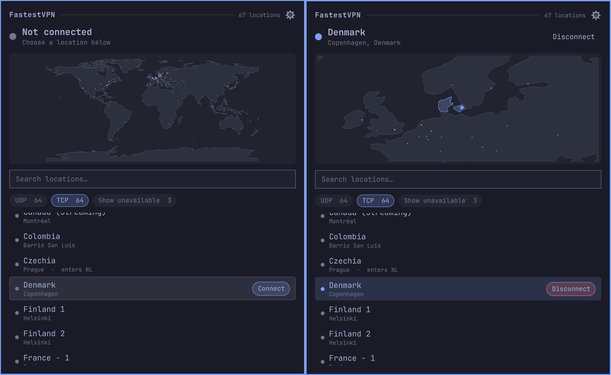

# FastestVPN for Omarchy

Connect, switch and monitor FastestVPN locations from the Omarchy bar, with a
world map of exit points.

> Work in progress. It does what is described here, but the panel is plain and
> parts of the location data are still rough.

## How it works

The plugin ships **no privileged component**. NetworkManager is the privileged
half, and it is already on every Omarchy box:

- `org.freedesktop.NetworkManager.network-control` defaults to
  `allow_active=yes`, so bringing a connection up or down never prompts.
- Importing profiles needs `settings.modify.system` (`auth_admin_keep`), which
  is a one-time setup step, not something the bar does.

So the running plugin is a plain unprivileged `nmcli` client.

## First run

Installing the plugin downloads nothing. `omarchy plugin add` clones the repo
and stops there — it never runs code from it, which is what lets you review a
plugin before enabling it. So setup happens in the panel, from the gear in its
header.

1. `omarchy pkg add networkmanager-openvpn`
2. Open the panel and click the gear. Fill in your **account**, **Save** the
   password, and set the **profile directory** if you do not want the default
   `~/.local/share/fastestvpn/profiles`.
3. **Refresh profiles** downloads FastestVPN's current bundle into that
   directory. **Add profiles…** copies in `.ovpn` files of your own; both can
   be used together.
4. **Import profiles** turns them into NetworkManager connections. This is the
   only step that asks for your password.

Locations appear as soon as the import finishes, and **Locate new** runs by
itself to fill in where each endpoint is.

Until something is imported the panel says so, and names the one step that is
next rather than reciting all of them:

| Panel says | What to do |
|---|---|
| Add your FastestVPN account and password in settings | fill in the account, then **Save** the password |
| Download FastestVPN's location profiles in settings | **Refresh profiles**, or add your own `.ovpn` files |
| The profiles are ready. Import them in settings | **Import profiles** |

## Requirements

You need a **FastestVPN account**. The plugin drives a subscription you already
have; it does not create one, and the profiles are useless without credentials
to authenticate them.

Everything the plugin runs is present on a default Omarchy except one package,
which the first step installs:

- **`networkmanager-openvpn`** — `omarchy pkg add networkmanager-openvpn`.
  NetworkManager cannot speak OpenVPN without it.

Everything else comes from Arch's `base` metapackage (`coreutils`, `findutils`,
`util-linux`, `systemd`, `grep`, `sed`, `bash`), from Omarchy's own package list
(`networkmanager`, `libsecret`, `unzip`), or from something Omarchy already
depends on (`curl` via `git`, `python` via `uwsm`/`ufw`, `polkit` via
`quickshell` itself).

`zenity` is optional. It provides the **Add profiles…** file picker, and the
button is hidden when it is absent — profiles can always be copied into the
directory by hand instead.

## Credentials

The password lives in the desktop keyring (Secret Service), never in
NetworkManager and never on disk in the clear. `bin/fvpn-connect` pipes it from
`secret-tool` straight into `nmcli … passwd-file /dev/stdin`, so it never
reaches a shell variable, never appears in `ps`, and is never written out.
Connections are stored `password-flags=2` (not-saved).

    bin/fvpn-creds store     # save the password
    bin/fvpn-creds status    # check without printing it
    bin/fvpn-creds forget    # remove it

This needs the login keyring unlocked, which rules out boot-time autoconnect
and headless SSH activation.

## Availability

Locations are never tested in the background. This avoids triggering
concurrency or rate-limits on your account.

An endpoint is therefore judged only when you ask to connect to it, and only
two outcomes mark it unavailable: the server not answering, or a tunnel that
comes up without a usable address. A rejected password never does, because
FastestVPN returns `AUTH_FAILED` for too many open sessions as well as for bad
credentials.

Verdicts live in `~/.local/state/fastestvpn/endpoints.json`. Hovering a row
shows what happened last time; **Retry** clears the verdict first, so nothing is
condemned permanently.

Clicking a location only selects it — a **Connect** button appears on the
selected row, so connecting is never one stray click away.

## Location data

`data/locations.json` is a catalogue of known endpoints: labels, coordinates and
notes such as `countryMismatch` (the exit geolocates to a different country than
the name claims) and `via` (the entry node of a double-hop profile, drawn on the
map as a dashed link).

`bin/fvpn-geolocate` fills in coordinates by resolving each profile's `remote`
host and looking the IP up with ip2location.io. It never connects through an
endpoint to find out where it is. One lookup is made per unique IP rather than
per file, so 134 profiles cost about 64 of the API's 1000 free daily calls, and
it only looks up what it does not already know.

## Tools

    bin/fvpn-fetch-profiles     # download the bundle into the profile directory
    bin/fvpn-geolocate          # locate endpoints not located yet (--all for every one)
    bin/fvpn-connect <conn>     # connect, or --down to disconnect
    bin/fvpn-creds              # keyring credential

Root, via pkexec, and both take `--dry-run`:

    bin/fvpn-import-profiles    # create the NetworkManager connections
    bin/fvpn-wipe               # remove every connection, profile and certificate

Reads of the profile directory are performed *as the invoking user* via
`runuser`, so a symlink planted in that user-writable directory cannot walk root
into a file it should not read.

## Attribution

`WorldMap.qml` adapts the projection, Natural Earth path data and pin rendering
from [OmaMullvad](https://github.com/kallupx/oma-mullvad) by kallupx, MIT
licensed — see `LICENSE.oma-mullvad`. The multi-hop link rendering is an
addition.

Endpoint IP addresses are geolocated by
[ip2location.io](https://api.ip2location.io), which fits easily inside their
free allowance of 1000 queries a day — one full run of `bin/fvpn-geolocate`
costs about 64.

`data/countries.json` is generated from
[Natural Earth](https://www.naturalearthdata.com/) 1:110m Admin 0 countries
(public domain), reprojected into the same equirectangular 1000×500 space as the
base map and reduced to an ISO 3166-1 alpha-2 key, an outline path, and the
bounding box of each landmass — the last of which lets the camera frame the
mainland United States rather than a box stretching from Alaska to Florida.

Licensed MIT — see `LICENSE`.
